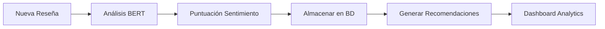

# Manual Técnico - Spotlyvf
## Aplicación Móvil de Recomendaciones de Lugares

---

### 📋 **INFORMACIÓN GENERAL**

- **Nombre del Proyecto**: Spotlyvf
- **Versión**: 1.0.0
- **Plataforma**: React Native con Expo
- **Base de Datos**: MySQL
- **Backend**: Django REST Framework con microservicios
- **Fecha**: Julio 2025

---

### 🏗️ **ARQUITECTURA DEL SISTEMA**

#### **Arquitectura General**
```
┌─────────────────┐    ┌──────────────────┐    ┌─────────────────┐
│   Frontend      │    │     Backend      │    │   Base de       │
│  React Native   │◄──►│  Django REST     │◄──►│   Datos MySQL   │
│    (Expo)       │    │   Framework      │    │                 │
└─────────────────┘    └──────────────────┘    └─────────────────┘
         ▲                       ▲                       ▲
         │                       │                       │
┌─────────────────┐    ┌──────────────────┐    ┌─────────────────┐
│  Google Maps    │    │   Microservicios │    │  AI Analytics   │
│      API        │    │  - Auth Service  │    │   - BERT        │
│                 │    │  - Place Service │    │   - OpenAI      │
│                 │    │  - Analytics     │    │   - Sentiment   │
└─────────────────┘    └──────────────────┘    └─────────────────┘
```

#### **Estructura de Directorios**
```
SPOTLYVF/
├── 📱 frontend/               # Aplicación React Native
│   ├── src/
│   │   ├── presentation/     # Pantallas y componentes UI
│   │   ├── data/            # APIs y servicios de datos
│   │   ├── domain/          # Tipos y modelos de negocio
│   │   └── assets/          # Imágenes y recursos
│   ├── app.json             # Configuración de Expo
│   └── package.json         # Dependencias del frontend
│
├── 🔧 backend/               # Servidor Django
│   ├── apps/
│   │   ├── auth_service/    # Autenticación y usuarios
│   │   ├── place_service/   # Lugares y reservas
│   │   └── analytics_service/ # Inteligencia artificial
│   ├── spotlyvf_backend/    # Configuración principal
│   ├── requirements.txt     # Dependencias de Python
│   └── manage.py           # Administrador de Django
│
├── 🤖 MODELO PREDICTORIO V3/ # Sistema de IA
│   ├── modelo_bert.py       # Modelo de análisis de sentimientos
│   ├── tokenizer.json       # Tokenizador BERT
│   └── reseñas_*.csv       # Datos de entrenamiento
│
├── 📋 Documentación/
│   ├── *.md                # Manuales y documentación
│   └── docker-compose.yml  # Configuración de contenedores
```

---

### 🚀 **INSTALACIÓN Y CONFIGURACIÓN**

#### **Prerrequisitos del Sistema**
- **Node.js** 18.0 o superior
- **Python** 3.11 o superior
- **MySQL** 8.0 o superior
- **Git** para control de versiones
- **Expo CLI** para desarrollo móvil

#### **Configuración del Backend**
```bash
# 1. Clonar el repositorio
git clone [URL_DEL_REPOSITORIO]
cd SPOTLYVF/backend

# 2. Crear entorno virtual
python -m venv venv
source venv/bin/activate  # Linux/Mac
# venv\Scripts\activate   # Windows

# 3. Instalar dependencias
pip install -r requirements.txt

# 4. Configurar base de datos
python manage.py migrate

# 5. Ejecutar servidor
python manage.py runserver 0.0.0.0:8000
```

#### **Configuración del Frontend**
```bash
# 1. Navegar al directorio frontend
cd SPOTLYVF/frontend

# 2. Instalar dependencias
npm install

# 3. Ejecutar aplicación
npx expo start
```

#### **Variables de Entorno**
```env
# Backend (.env)
DATABASE_NAME=spotlyvf
DATABASE_USER=root
DATABASE_PASSWORD=spotlyvf2024
DATABASE_HOST=192.168.100.13
DATABASE_PORT=3306

# Frontend (.env)
API_BASE_URL=http://192.168.100.13:8000/api/v1
GOOGLE_MAPS_API_KEY=[TU_API_KEY]
```

---

### 🗄️ **BASE DE DATOS**

#### **Modelo de Datos Principal**
```sql
-- Tabla de Usuarios
auth_user (
    id, username, email, first_name, last_name, 
    role, phone, created_at, updated_at
)

-- Tabla de Lugares
place_service_place (
    id, name, description, address, latitude, longitude,
    category_id, rating, phone, website, created_at
)

-- Tabla de Reservas
place_service_reservation (
    id, user_id, place_id, google_place_id,
    reservation_date, reservation_time, party_size,
    status, contact_name, contact_phone, created_at
)

-- Tabla de Reseñas
place_service_review (
    id, user_id, google_place_id, rating, comment,
    sentiment_score, is_ai_analyzed, created_at
)
```

#### **Relaciones Principales**
- **Usuario → Reservas**: Un usuario puede tener múltiples reservas
- **Usuario → Reseñas**: Un usuario puede escribir múltiples reseñas
- **Lugar → Reservas**: Un lugar puede tener múltiples reservas
- **Lugar → Reseñas**: Un lugar puede tener múltiples reseñas

---

### 🔗 **APIs Y ENDPOINTS**

#### **Autenticación**
```http
POST /api/v1/auth/login/
POST /api/v1/auth/register/
POST /api/v1/auth/logout/
POST /api/v1/auth/refresh/
```

#### **Lugares y Búsqueda**
```http
GET    /api/v1/places/                    # Listar lugares
GET    /api/v1/places/{id}/               # Detalle de lugar
GET    /api/v1/places/search/             # Búsqueda de lugares
GET    /api/v1/places/nearby/             # Lugares cercanos
GET    /api/v1/places/categories/         # Categorías disponibles
```

#### **Reservas**
```http
GET    /api/v1/reservations/              # Mis reservas (usuario)
POST   /api/v1/reservations/              # Crear reserva
PUT    /api/v1/reservations/{id}/         # Actualizar reserva
DELETE /api/v1/reservations/{id}/         # Cancelar reserva

# Gestión de Negocios
GET    /api/v1/business/reservations/     # Reservas del negocio
POST   /api/v1/business/reservations/{id}/approve/   # Aprobar
POST   /api/v1/business/reservations/{id}/reject/    # Rechazar
```

#### **Reseñas**
```http
GET    /api/v1/reviews/                   # Mis reseñas
POST   /api/v1/reviews/                   # Crear reseña
GET    /api/v1/places/{id}/reviews/       # Reseñas de un lugar
```

#### **Analytics IA**
```http
GET    /api/v1/analytics/demo/dashboard/     # Dashboard sin auth
POST   /api/v1/analytics/demo/analyze/      # Análisis de negocio
GET    /api/v1/analytics/                   # Analytics completos
```

---

### 🤖 **SISTEMA DE INTELIGENCIA ARTIFICIAL**

#### **Componentes de IA**
1. **Análisis de Sentimientos** (BERT)
   - Procesa reseñas de usuarios
   - Clasifica sentimientos: Positivo, Negativo, Neutro
   - Genera puntuaciones de 0.0 a 1.0

2. **Generación de Recomendaciones** (OpenAI GPT)
   - Analiza reseñas negativas
   - Genera sugerencias específicas para mejorar
   - Categoriza recomendaciones por áreas

3. **Analytics Predictivos**
   - Tendencias de satisfacción
   - Predicción de rating promedio
   - Identificación de problemas recurrentes

#### **Flujo de Procesamiento IA**


---

### 🔐 **SEGURIDAD**

#### **Autenticación y Autorización**
- **JWT Tokens**: Autenticación basada en tokens
- **Roles de Usuario**: USER, BUSINESS, ADMIN
- **Middleware de Autenticación**: Protege endpoints sensibles
- **Refresh Tokens**: Renovación automática de sesiones

#### **Validación de Datos**
- **Serializers de Django**: Validación en backend
- **TypeScript**: Tipado fuerte en frontend
- **Sanitización**: Limpieza de inputs del usuario

#### **Protección de APIs**
- **CORS**: Configurado para dominios específicos
- **Rate Limiting**: Límites de requests por usuario
- **Validación de Parámetros**: Verificación de entrada

---

### 📊 **MONITOREO Y LOGS**

#### **Logs del Sistema**
```python
# Configuración de logging en Django
LOGGING = {
    'version': 1,
    'handlers': {
        'file': {
            'level': 'INFO',
            'class': 'logging.FileHandler',
            'filename': 'logs/spotlyvf.log',
        },
    },
    'loggers': {
        'django': {'handlers': ['file'], 'level': 'INFO'},
        'analytics': {'handlers': ['file'], 'level': 'DEBUG'},
    }
}
```

#### **Métricas de Performance**
- **Tiempo de respuesta** de APIs
- **Uso de memoria** del servidor
- **Número de usuarios activos**
- **Accuracy del modelo IA**

---

### 🔧 **MANTENIMIENTO**

#### **Backup de Base de Datos**
```bash
# Crear backup
mysqldump -u root -p spotlyvf > backup_$(date +%Y%m%d).sql

# Restaurar backup
mysql -u root -p spotlyvf < backup_20250720.sql
```

#### **Actualización del Sistema**
```bash
# Backend
cd backend
git pull origin main
pip install -r requirements.txt
python manage.py migrate
python manage.py collectstatic

# Frontend
cd frontend
git pull origin main
npm install
npx expo export
```

#### **Tareas de Mantenimiento**
- **Limpieza de logs** antiguos (>30 días)
- **Backup automático** de base de datos
- **Actualización de dependencias** mensual
- **Reentrenamiento del modelo IA** trimestral

---

### ⚡ **OPTIMIZACIÓN**

#### **Performance del Backend**
- **Indexación de BD**: Índices en campos de búsqueda
- **Cache de Redis**: Para datos frecuentemente accedidos
- **Paginación**: Para listas grandes de datos
- **Lazy Loading**: Carga bajo demanda

#### **Performance del Frontend**
- **Image Optimization**: Compresión de imágenes
- **Bundle Splitting**: Carga modular de código
- **Memoization**: Cache de componentes React
- **Offline Support**: Funcionalidad sin conexión

---

### 🐛 **TROUBLESHOOTING**

#### **Problemas Comunes**

**1. Error de conexión a base de datos**
```bash
# Verificar conexión
mysql -h 192.168.100.13 -u root -p

# Reiniciar servicio MySQL
sudo systemctl restart mysql
```

**2. Error de memoria en modelo IA**
```python
# Liberar memoria GPU
import torch
torch.cuda.empty_cache()

# Reducir batch size
batch_size = 16  # En lugar de 32
```

**3. Problemas de autenticación**
```javascript
// Limpiar tokens expirados
await AsyncStorage.removeItem('auth_token');
await AsyncStorage.removeItem('refresh_token');
```

#### **Códigos de Error**
- **401**: Token expirado o inválido
- **403**: Sin permisos para la acción
- **404**: Recurso no encontrado
- **500**: Error interno del servidor

---

### 📞 **CONTACTO Y SOPORTE**

#### **Equipo de Desarrollo**
- **Desarrollador Principal**: [Tu Nombre]
- **Email**: [tu.email@ejemplo.com]
- **Repositorio**: [URL del repositorio]

#### **Documentación Adicional**
- **API Documentation**: http://192.168.100.13:8000/api/docs/
- **Admin Panel**: http://192.168.100.13:8000/admin/
- **Status Page**: http://192.168.100.13:8000/health/

---

*Manual Técnico Spotlyvf v1.0 - Julio 2025*
